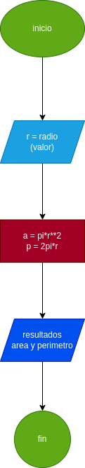

# area-perimetro-circulo

# analisis

calcualar el area y perimetro de un circulo con las siguientes formulas teniendo la variable radio como entrada.  

formula-area-circulo = pi*r**2

formula-perimetro circulo = pi*r

## diseno

